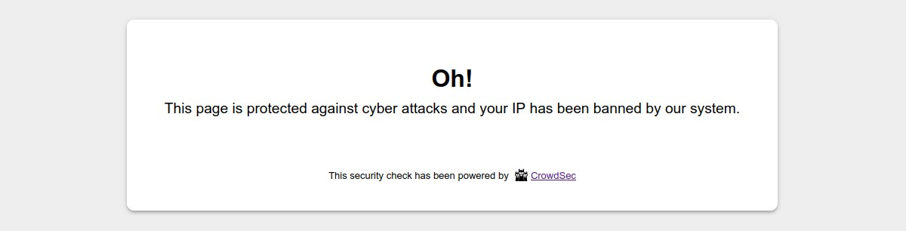

# CrowdSec Bouncer PHP library

## User Guide


<!-- START doctoc generated TOC please keep comment here to allow auto update -->
<!-- DON'T EDIT THIS SECTION, INSTEAD RE-RUN doctoc TO UPDATE -->
**Table of Contents**

- [Description](#description)
- [Prerequisites](#prerequisites)
- [Features](#features)
- [Usage](#usage)
- [Standalone bouncer set up](#standalone-bouncer-set-up)
  - [Copy sources](#copy-sources)
  - [Files permission](#files-permission)
  - [Composer](#composer)
  - [Settings file](#settings-file)
  - [`auto_prepend_file` directive](#auto_prepend_file-directive)
    - [`.ini` file](#ini-file)
    - [Nginx](#nginx)
    - [Apache](#apache)
  - [Stream mode cron task](#stream-mode-cron-task)
- [Create your own bouncer](#create-your-own-bouncer)
  - [Implementation](#implementation)
  - [Test your bouncer](#test-your-bouncer)
- [Configurations](#configurations)
  - [Bouncer behavior](#bouncer-behavior)
  - [Local API Connection](#local-api-connection)
  - [Cache](#cache)
  - [Geolocation](#geolocation)
  - [Captcha and ban wall settings](#captcha-and-ban-wall-settings)
  - [Debug](#debug)
- [Other ready to use PHP bouncers](#other-ready-to-use-php-bouncers)

<!-- END doctoc generated TOC please keep comment here to allow auto update -->


## Description

This library allows you to create CrowdSec bouncers for PHP applications or frameworks like e-commerce, blog or other 
exposed applications. It can also be used in a standalone mode using auto-prepend directive and the provided standalone 
bouncer.

## Prerequisites

To be able to use this bouncer, the first step is to install [CrowdSec v1](https://doc.crowdsec.net/docs/getting_started/install_crowdsec/). CrowdSec is only in charge of the "detection", and won't block anything on its own. You need to deploy a bouncer to "apply" decisions.

Please note that first and foremost a CrowdSec agent must be installed on a server that is accessible by this library.

## Features

- CrowdSec Local API Support
  - Handle `ip`, `range` and `country` scoped decisions
  - Clear, prune and refresh the Local API cache
  - `Live mode` or `Stream mode`
- Support IpV4 and Ipv6 (Ipv6 range decisions are yet only supported in `Live mode`) 
- Large PHP matrix compatibility: 7.2, 7.3, 7.4, 8.0, 8.1 and 8.2
- Built-in support for the most known cache systems Redis, Memcached and PhpFiles
- Cap remediation level (ex: for sensitives websites: ban will be capped to captcha)


## Usage

When a user is suspected by CrowdSec to be malevolent, a bouncer would either display a captcha to resolve or
simply a page notifying that access is denied. If the user is considered as a clean user, he/she will access the page 
as normal.

A ban wall could look like:



A captcha wall could look like:


With the provided standalone bouncer, please note that it is possible to customize all the colors of these pages so that they integrate best with your design.

On the other hand, all texts are also fully customizable. This will allow you, for example, to present translated pages in your users' language.


## Standalone bouncer set up

This library includes the [`StandaloneBouncer`](../src/StandaloneBouncer.php) class. You can see that class as a good example for creating your own bouncer. 

Once you set up your server as below, every browser access to a php script will be bounced by the standalone bouncer.

You will have to :

- copy sources of the lib in some `/path/to/the/crowdsec-lib` folder

- give the correct permission for the folder that contains the lib

- copy the `scripts/auto-prepend/settings.example.php` to a `scripts/auto-prepend/settings.php` file

- run the composer installation process to retrieve all necessary dependencies

- set an `auto_prepend_file` directive in your PHP setup.

- Optionally, if you want to use the standalone bouncer in stream mode, you wil have to set a cron task to refresh 
  cache periodically.

### Copy sources

Create a folder `crowdsec-lib` and clone the sources: 

```shell
mkdir -p /path/to/the/crowdsec-lib && git clone git@github.com:crowdsecurity/php-cs-bouncer.git /path/to/the/crowdsec-lib
```

### Files permission

The owner of the `/path/to/the/crowdsec-lib` should be your webserver owner (e.g. `www-data`).

You can achieve it by running command like:

```shell
sudo chown www-data /path/to/the/crowdsec-lib
```

### Composer

You should run the composer installation process: 

```shell
cd /path/to/the/crowdsec-lib && composer install
```

### Settings file

Please copy the `scripts/auto-prepend/settings.example.php` to a `scripts/auto-prepend/settings.php` and fill the necessary settings in it (see [Configurations settings](#configurations) for more details).

### `auto_prepend_file` directive

We will now describe how to set an `auto_prepend_file` directive in order to call the `scripts/auto-prepend/bounce.php` for each php script access.

Adding an `auto_prepend_file` directive can be done in different ways:

#### `.ini` file

You should add this line to a `.ini` file :

    auto_prepend_file = /absolute/path/to/scripts/auto-prepend/bounce.php

#### Nginx

If you are using Nginx, you should modify your Nginx configuration file by adding a `fastcgi_param` directive. The php block should look like below:

```
location ~ \.php$ {
    ...
    ...
    ...
    fastcgi_param PHP_VALUE "/absolute/path/to/scripts/auto-prepend/bounce.php";
}
```

#### Apache

If you are using Apache, you should add this line to your `.htaccess` file:

    php_value auto_prepend_file "/absolute/path/to/scripts/auto-prepend/bounce.php"

or modify your `Virtual Host` accordingly:

```
<VirtualHost ...>
    ...
    ...
    php_value auto_prepend_file "/absolute/path/to/scripts/auto-prepend/bounce.php"
    
</VirtualHost>
```


### Stream mode cron task

To use the stream mode, you first have to set the `stream_mode` setting value to `true` in your `scripts/auto-prepend/settings.php` file. 

Then, you could edit the web server user (e.g. `www-data`) crontab: 

```shell
sudo -u www-data crontab -e
```

and add the following line

```shell
* * * * * /usr/bin/php /absolute/path/to/scripts/auto-prepend/refresh-cache.php
```

In this example, cache is refreshed every minute, but you can modify the cron expression depending on your needs.

## Create your own bouncer

### Implementation

You can use this library to develop your own PHP application bouncer. Any custom bouncer should extend the [`AbstractBouncer`](../src/AbstractBouncer.php) class.

```php
namespace MyNameSpace;

use CrowdSecBouncer\AbstractBouncer;

class MyCustomBouncer extends AbstractBouncer
{
}
```

Then, you will have to implement all necessary methods :

```php
namespace MyNameSpace;

use CrowdSecBouncer\AbstractBouncer;

class MyCustomBouncer extends AbstractBouncer
{
    /**
     * Get current http method
     */
    public function getHttpMethod(): string
    {
        // Your implementation
    }

    /**
     * Get value of an HTTP request header. Ex: "X-Forwarded-For"
     */
    public function getHttpRequestHeader(string $name): ?string
    {
        // Your implementation
    }
    
    /**
     * Get the value of a posted field.
     */
    public function getPostedVariable(string $name): ?string
    {
        // Your implementation
    }
    
    /**
     * Get the current IP, even if it's the IP of a proxy
     */
    public function getRemoteIp(): string
    {
        // Your implementation
    }

    /**
     * Get current request uri
     */
    public function getRequestUri(): string 
    {
        // Your implementation
    }

}
```


Once you have implemented these methods, you could retrieve all required configurations to instantiate your bouncer and then call the `run` method to apply a bounce for the current detected IP.

In order to instantiate the bouncer, you will have to create at least a `CrowdSec\RemediationEngine\LapiRemediation` 
object too. 


```php
use MyNameSpace\MyCustomBouncer;
use CrowdSec\RemediationEngine\LapiRemediation;
use CrowdSec\LapiClient\Bouncer as BouncerClient;
use CrowdSec\RemediationEngine\CacheStorage\PhpFiles;

$configs = [...];
$client = new BouncerClient($configs);
$cacheStorage = new PhpFiles($configs);
$remediationEngine = new LapiRemediation($configs, $client, $cacheStorage);

$bouncer = new MyCustomBouncer($configs, $remediationEngine);

$bouncer->run();

```


### Test your bouncer

To test your bouncer, you could add decision to ban your own IP for 5 minutes for example:

```bash
cscli decisions add --ip <YOUR_IP> --duration 5m --type ban
```

You can also test a captcha:

```bash
cscli decisions delete --all # be careful with this command!
cscli decisions add --ip <YOUR_IP> --duration 15m --type captcha
```


To go further and learn how to include this library in your project, you should follow the [`DEVELOPER GUIDE`](DEVELOPER.md).

## Configurations

You can pass an array of configurations in the bouncer constructor. Please look at the [Settings example file](../scripts/auto-prepend/settings.example.php) for quick overview.

Here is the list of available settings:

### Bouncer behavior

- `bouncing_level`:  Select from `bouncing_disabled`, `normal_bouncing` or `flex_bouncing`. Choose if you want to apply CrowdSec directives (Normal bouncing) or be more permissive (Flex bouncing). With the `Flex mode`, it is impossible to accidentally block access to your site to people who don’t deserve it. This mode makes it possible to never ban an IP but only to offer a captcha, in the worst-case scenario.


- `fallback_remediation`: Select from `bypass` (minimum remediation), `captcha` or `ban` (maximum remediation). Default to 'captcha'. Handle unknown remediations as.


- `trust_ip_forward_array`:  If you use a CDN, a reverse proxy or a load balancer, set an array of IPs. For other IPs, the bouncer will not trust the X-Forwarded-For header.


- `excluded_uris`: array of URIs that will not be bounced.


- `stream_mode`: true to enable stream mode, false to enable the live mode. Default to false. By default, the `live mode` is enabled. The first time a stranger connects to your website, this mode means that the IP will be checked directly by the CrowdSec API. The rest of your user’s browsing will be even more transparent thanks to the fully customizable cache system. But you can also activate the `stream mode`. This mode allows you to constantly feed the bouncer with the malicious IP list via a background task (CRON), making it to be even faster when checking the IP of your visitors. Besides, if your site has a lot of unique visitors at the same time, this will not influence the traffic to the API of your CrowdSec instance.

### Local API Connection

- `auth_type`: Select from `api_key` and `tls`. Choose if you want to use an API-KEY or a TLS (pki) authentification.
  TLS authentication is only available if you use CrowdSec agent with a version superior to 1.4.0.


- `api_key`: Key generated by the cscli (CrowdSec cli) command like `cscli bouncers add bouncer-php-library`.
  Only required if you choose `api_key` as `auth_type`.


- `tls_cert_path`: absolute path to the bouncer certificate (e.g. pem file).
  Only required if you choose `tls` as `auth_type`.


- `tls_key_path`: Absolute path to the bouncer key (e.g. pem file).
  Only required if you choose `tls` as `auth_type`.


- `tls_verify_peer`: This option determines whether request handler verifies the authenticity of the peer's certificate.
  Only required if you choose `tls` as `auth_type`.
  When negotiating a TLS or SSL connection, the server sends a certificate indicating its identity.
  If `tls_verify_peer` is set to true, request handler verifies whether the certificate is authentic.
  This trust is based on a chain of digital signatures,
  rooted in certification authority (CA) certificates you supply using the `tls_ca_cert_path` setting below.


- `tls_ca_cert_path`: Absolute path to the CA used to process peer verification.
  Only required if you choose `tls` as `auth_type` and `tls_verify_peer` is set to true.


- `api_url`: Define the URL to your Local API server, default to `http://localhost:8080`.


- `api_timeout`: In seconds. The timeout when calling Local API. Default to 120 sec. If set to a negative value,
  timeout will be unlimited.


- `use_curl`: By default, this lib call the REST Local API using `file_get_contents` method (`allow_url_fopen` is required).
  You can set `use_curl` to `true` in order to use `cURL` request instead (`curl` is in then required)

### Cache

- `cache_system`: Select from `phpfs` (PHP file cache), `redis` or `memcached`.


- `fs_cache_path`: Will be used only if you choose PHP file cache as `cache_system`. Important note: be sur this path
  won't be publicly accessible.


- `redis_dsn`:   Will be used only if you choose Redis cache as `cache_system`.


- `memcached_dsn`: Will be used only if you choose Memcached as `cache_system`.


- `clean_ip_cache_duration`: Set the duration we keep in cache the fact that an IP is clean. In seconds. Defaults to 5.


- `bad_ip_cache_duration`: Set the duration we keep in cache the fact that an IP is bad. In seconds. Defaults to 20.


- `captcha_cache_duration`: Set the duration we keep in cache the captcha flow variables for an IP. In seconds.
  Defaults to 86400.. In seconds. Defaults to 20.


### Geolocation

- `geolocation`: Settings for geolocation remediation (i.e. country based remediation).

    - `geolocation[enabled]`: true to enable remediation based on country. Default to false.

    - `geolocation[type]`:  Geolocation system. Only 'maxmind' is available for the moment. Default to `maxmind`.

    - `geolocation[cache_duration]`: This setting will be used to set the lifetime (in seconds) of a cached country
      associated to an IP. The purpose is to avoid multiple call to the geolocation system (e.g. maxmind database). Default to 86400. Set 0 to disable caching.

    - `geolocation[maxmind]`: MaxMind settings.

    - `geolocation[maxmind][database_type]`: Select from `country` or `city`. Default to `country`. These are the two available MaxMind database types.

    - `geolocation[maxmind][database_path]`: Absolute path to the MaxMind database (e.g. mmdb file)


### Captcha and ban wall settings


- `hide_mentions`: true to hide CrowdSec mentions on ban and captcha walls.


- `custom_css`: Custom css directives for ban and captcha walls


- `color`: Array of settings for ban and captcha walls colors.

    - `color[text][primary]`

    - `color[text][secondary]`

    - `color[text][button]`

    - `color[text][error_message]`

    - `color[background][page]`

    - `color[background][container]`

    - `color[background][button]`

    - `color[background][button_hover]`


- `text`: Array of settings for ban and captcha walls texts.

    - `text[captcha_wall][tab_title]`

    - `text[captcha_wall][title]`

    - `text[captcha_wall][subtitle]`

    - `text[captcha_wall][refresh_image_link]`

    - `text[captcha_wall][captcha_placeholder]`

    - `text[captcha_wall][send_button]`

    - `text[captcha_wall][error_message]`

    - `text[captcha_wall][footer]`

    - `text[ban_wall][tab_title]`

    - `text[ban_wall][title]`

    - `text[ban_wall][subtitle]`

    - `text[ban_wall][footer]`


### Debug
- `debug_mode`: `true` to enable verbose debug log. Default to `false`.


- `disable_prod_log`: `true` to disable prod log. Default to `false`.


- `log_directory_path`: Absolute path to store log files. Important note: be sure this path won't be publicly
  accessible.


- `display_errors`: true to stop the process and display errors on browser if any.


- `forced_test_ip`: Only for test or debug purpose. Default to empty. If not empty, it will be used instead of the
  real remote ip.


- `forced_test_forwarded_ip`: Only for test or debug purpose. Default to empty. If not empty, it will be used
  instead of the real forwarded ip. If set to `no_forward`, the x-forwarded-for mechanism will not be used at all.


## Other ready to use PHP bouncers

To have a more concrete idea on how to develop a bouncer, you may look at the following bouncers for Magento 2 and 
WordPress :
- [CrowdSec Bouncer extension for Magento 2](https://github.com/crowdsecurity/cs-magento-bouncer)
- [CrowdSec Bouncer plugin for WordPress ](https://github.com/crowdsecurity/cs-wordpress-bouncer)

