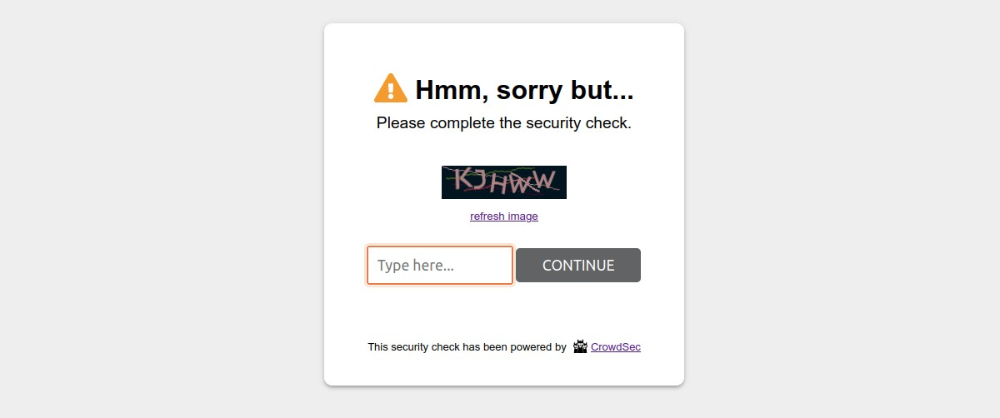

# CrowdSec Bouncer PHP library

## User Guide

<!-- START doctoc generated TOC please keep comment here to allow auto update -->
<!-- DON'T EDIT THIS SECTION, INSTEAD RE-RUN doctoc TO UPDATE -->
**Table of Contents**

- [Description](#description)
- [Prerequisites](#prerequisites)
- [Features](#features)
- [Usage](#usage)
- [Create your own bouncer](#create-your-own-bouncer)
  - [Implementation](#implementation)
  - [Test your bouncer](#test-your-bouncer)
- [Configurations](#configurations)
  - [Bouncer behavior](#bouncer-behavior)
  - [Local API Connection](#local-api-connection)
  - [Cache](#cache)
  - [Geolocation](#geolocation)
  - [Captcha and ban wall settings](#captcha-and-ban-wall-settings)
  - [Debug](#debug)
  - [Security note](#security-note)
- [Other ready to use PHP bouncers](#other-ready-to-use-php-bouncers)

<!-- END doctoc generated TOC please keep comment here to allow auto update -->


## Description

This library allows you to create CrowdSec bouncers for PHP applications or frameworks like e-commerce, blog or other 
exposed applications.


## Features

- Apply a `ban` or `captcha` remediation
  - Block user access for a `ban` remediation with a 403 customizable page (ban wall).
  - Display a 401 customizable captcha page (captcha wall) for a `captcha` remediation.
- CrowdSec Local API (`LAPI`) support
  - Handle `ip`, `range` and `country` scoped decisions
  - `Live mode` or `Stream mode`
  - Api key and TLS authentication
- CrowdSec Central API (`CAPI`) support
  - Handle `ip` and `range` scoped decisions
  - Support CrowdSec community blocklist and subscribed third party blocklists
- Support IpV4 and Ipv6 (Ipv6 range decisions are yet only supported in `LAPI`'s `Live mode`) 
- Large PHP matrix compatibility: 7.2, 7.3, 7.4, 8.0, 8.1 and 8.2
- Built-in support for the most known cache systems Redis, Memcached and PhpFiles
  - Clear, prune and refresh the bouncer cache
- Cap remediation level (ex: for sensitives websites: ban will be capped to captcha)

## Prerequisites for `LAPI`

To be able to use a `LAPI` bouncer based on this library, the first step is to install [CrowdSec v1](https://doc.crowdsec.net/docs/getting_started/install_crowdsec/). CrowdSec is only in charge of the "detection", and won't block anything on its own. You need to deploy a bouncer to "apply" decisions.

Please note that first and foremost a CrowdSec agent must be installed on a server that is accessible by this library.


## Usage

When a user is suspected by CrowdSec to be malevolent, a bouncer would either display a captcha to resolve or
simply a page notifying that access is denied. If the user is considered as a clean user, he/she will access the page 
as normal.

A ban wall could look like:


A captcha wall could look like:



Please note that it is possible to customize all the colors of these pages so that they integrate best with your design.

On the other hand, all texts are also fully customizable. This will allow you, for example, to present translated pages in your users' language.

## Create your own bouncer

### Implementation

You can use this library to develop your own PHP application bouncer. 

If you want to create a `LAPI` or a `CAPI` based custom bouncer, it should extend the [`AbstractBouncer`](../src/AbstractBouncer.php) class.

```php
namespace MyNameSpace;

use CrowdSecBouncer\AbstractBouncer;

class MyCustomBouncer extends AbstractBouncer
{
}
```

In both cases (`LAPI` and `CAPI`), you'll need to implement all necessary methods:

```php
namespace MyNameSpace;

use CrowdSecBouncer\AbstractBouncer;

class MyCustomBouncer extends AbstractBouncer
{
    /**
     * Get current http method
     */
    public function getHttpMethod(): string
    {
        // Your implementation
    }

    /**
     * Get value of an HTTP request header. Ex: "X-Forwarded-For"
     */
    public function getHttpRequestHeader(string $name): ?string
    {
        // Your implementation
    }
    
    /**
     * Get the value of a posted field.
     */
    public function getPostedVariable(string $name): ?string
    {
        // Your implementation
    }
    
    /**
     * Get the current IP, even if it's the IP of a proxy
     */
    public function getRemoteIp(): string
    {
        // Your implementation
    }

    /**
     * Get current request uri
     */
    public function getRequestUri(): string 
    {
        // Your implementation
    }

}
```

Once you have implemented these methods, you could retrieve all required configurations to instantiate your bouncer 
and then call the `run` method to apply a bounce for the current detected IP. Please see below for the list of 
available configurations.

#### Bouncer using `LAPI` remediation

To use `LAPI` as remediation source, simply instantiate your class with the appropriate configuration.

```php
use MyNameSpace\MyCustomBouncer;

$configs = [...];

$bouncer = new MyCustomBouncer($configs);

$bouncer->run();
```


#### Bouncer using `CAPI` remediation


In order to instantiate a `CAPI` bouncer, you will have to implement the `CrowdSec\CapiClient\Storage\StorageInterface` 
interface. 

As an example, you could use the development implementation `CrowdSec\CapiClient\Storage\FileStorage`.


```php
use MyNameSpace\MyCustomBouncer;
use CrowdSec\CapiClient\Storage\FileStorage;

$configs = [...];

$capiStorage = new FileStorage();
$bouncer = new MyCustomBouncer($configs, $capiStorage);

$bouncer->run();
```


### Test your `LAPI` bouncer

To test your `LAPI` bouncer, you could add decision to ban your own IP for 5 minutes for example:

```bash
cscli decisions add --ip <YOUR_IP> --duration 5m --type ban
```

You can also test a captcha:

```bash
cscli decisions delete --all # be careful with this command!
cscli decisions add --ip <YOUR_IP> --duration 15m --type captcha
```


To go further and learn how to include this library in your project, you should follow the [`DEVELOPER GUIDE`](DEVELOPER.md).

## Configurations

The first parameter of the bouncer's constructor method is an array of settings.

Below is the list of available settings:

### Bouncer behavior

- `bouncing_level`:  Select from `bouncing_disabled`, `normal_bouncing` or `flex_bouncing`. Choose if you want to apply CrowdSec directives (Normal bouncing) or be more permissive (Flex bouncing). With the `Flex mode`, it is impossible to accidentally block access to your site to people who don’t deserve it. This mode makes it possible to never ban an IP but only to offer a captcha, in the worst-case scenario.

- `ordered_remediations`: array of handled remediations ordered by priority. 

  If there are more than one decision for an IP, remediation with the highest priority will be return.

  The specific remediation `bypass` will always be considered as the lowest priority (there is no need to specify it 
  in this setting).

  This setting is not required. If you don't set any value, `['ban']` will be used by default for `CAPI` bouncer and
  `['ban', 'captcha']` for `LAPI` bouncer.


- `fallback_remediation`: determine which remediation to use in case a decision has a type that does not belong to the above `ordered_remediations` setting.

  This setting is not required. If you don't set any value, `bypass` will be used by default.

  If you set some custom value, be aware to include this value in the `ordered_remediations` setting too.


- `trust_ip_forward_array`:  If you use a CDN, a reverse proxy or a load balancer, set an array of comparable IPs arrays:
  (example: `[['001.002.003.004', '001.002.003.004'], ['005.006.007.008', '005.006.007.008']]` for CDNs with IPs `1.2.3.4` and `5.6.7.8`). For other IPs, the bouncer will not trust the X-Forwarded-For header.


- `excluded_uris`: array of URIs that will not be bounced.


- `stream_mode`: (**only configurable for LAPI bouncer as CAPI bouncer only works in stream mode**) 

  `true` to enable stream mode, `false` to enable the live mode. Default to false for `LAPI` bouncer. Always `true` for `CAPI` bouncer.

  - `live mode`: The first time a stranger connects to your website, its IP will be checked directly by the CrowdSec LAPI. The rest of your user’s browsing will be even more transparent thanks to the fully customizable cache system. 
  - `stream mode`: This mode allows you to constantly feed the bouncer with the malicious IP list via a background task (CRON), making it to be even faster when checking the IP of your visitors. Besides, if your site has a lot of unique visitors at the same time, this will not influence the traffic to the `LAPI` of your CrowdSec instance.

### API Connection

- `api_timeout`: In seconds. The timeout when calling `LAPI` or `CAPI`. Default to 120 sec. If set to a negative value,
  timeout will be unlimited.

- `use_curl`: By default, this lib call the REST LAPI and CAPI  endpoints using `file_get_contents` method (`allow_url_fopen` is required).
  You can set `use_curl` to `true` in order to use `cURL` request instead (`ext-curl` is in then required)

- `user_agent_suffix`: This setting is not required.

  Sending a `User-Agent` header during a `CAPI` or `LAPI` call is mandatory. By default, user agent will be `csphpcapi/vX.Y.Z` or `csphplapi/vX.Y.Z`.

  You can add a custom suffix to this value by using the `user_agent_suffix` setting.  It must be a string matching the regular expression `#^[a-z0-9]{0,16}$#`. At the end, user agent will be like `csphp(c|l)api_MySuffix/vX.Y.Z`.

- `user_agent_version`: This setting is not required.

  As mentioned above, default user agent is `csphp(c|l)api/vX.Y.Z` where `vX.Y.Z` is the current release version of some dependencies of this library.

  You can add a custom version to this value by using the `user_agent_version` setting. It must be a string matching the regular expression `#^v\d{1,4}(\.\d{1,4}){2}$#`.

#### LAPI connection specificities

- `auth_type`: Select from `api_key` and `tls`. Choose if you want to use an API-KEY or a TLS (pki) authentification.
  TLS authentication is only available if you use CrowdSec agent with a version superior to 1.4.0.


- `api_key`: Key generated by the cscli (CrowdSec cli) command like `cscli bouncers add bouncer-php-library`.
  Only required if you choose `api_key` as `auth_type`.


- `tls_cert_path`: absolute path to the bouncer certificate (e.g. pem file).
  Only required if you choose `tls` as `auth_type`.
  **Make sure this path is not publicly accessible.** [See security note below](#security-note).


- `tls_key_path`: Absolute path to the bouncer key (e.g. pem file).
  Only required if you choose `tls` as `auth_type`.
  **Make sure this path is not publicly accessible.** [See security note below](#security-note).


- `tls_verify_peer`: This option determines whether request handler verifies the authenticity of the peer's certificate.
  Only required if you choose `tls` as `auth_type`.
  When negotiating a TLS or SSL connection, the server sends a certificate indicating its identity.
  If `tls_verify_peer` is set to true, request handler verifies whether the certificate is authentic.
  This trust is based on a chain of digital signatures,
  rooted in certification authority (CA) certificates you supply using the `tls_ca_cert_path` setting below.


- `tls_ca_cert_path`: Absolute path to the CA used to process peer verification.
  Only required if you choose `tls` as `auth_type` and `tls_verify_peer` is set to true.
  **Make sure this path is not publicly accessible.** [See security note below](#security-note).


- `api_url`: Define the URL to your Local API server, default to `http://localhost:8080`.

#### CAPI connection specificities

- `env`: only accepts two values : `dev` and `prod`. 

  This setting is not required. If you don't set any value, `dev` will be used by default.

  It will mainly change the called CAPI url:
  - `https://api.dev.crowdsec.net/v2/` for the `dev` environment
  - `https://api.crowdsec.net/v2/` for the `prod` one.

- `scenarios`: This `scenarios` setting **is required**.

  You have to pass an array of CrowdSec scenarios that will be used to log in your watcher. 
  You should find a list of available scenarios on the [CrowdSec hub collections page](https://hub.crowdsec.net/browse/).


  Each scenario must match the regular expression `#^[A-Za-z0-9]{0,16}\/[A-Za-z0-9_-]{0,64}$#`.

- `machine_id_prefix`: This setting is not required.

  When you make your first call with a `CAPI` client, a `machine_id` will be generated and stored through your storage 
  implementation. This `machine_id` is a string of length 48 composed of characters matching the regular expression `#^[a-z0-9]+$#`.

  The `machine_id_prefix` setting allows to set a custom prefix to this `machine_id`. It must be a string matching the regular expression `#^[a-z0-9]{0,16}$#`. 

  The final generated `machine_id` will still have a length of 48.

### Cache


- `fs_cache_path`: Will be used only if you choose PHP file cache as cache storage.
  **Make sure this path is not publicly accessible.** [See security note below](#security-note).


- `redis_dsn`:   Will be used only if you choose Redis cache as cache storage.


- `memcached_dsn`: Will be used only if you choose Memcached as cache storage.


- `clean_ip_cache_duration`: Set the duration we keep in cache the fact that an IP is clean. In seconds. Defaults to 5.


- `bad_ip_cache_duration`: Set the duration we keep in cache the fact that an IP is bad. In seconds. Defaults to 20.


- `captcha_cache_duration`: Set the duration we keep in cache the captcha flow variables for an IP. In seconds.
  Defaults to 86400.. In seconds. Defaults to 20.


### Geolocation

- `geolocation`: Settings for geolocation remediation (i.e. country based remediation). **Only available for LAPI bouncer.**
    - `geolocation[enabled]`: true to enable remediation based on country. Default to false.
    
    - `geolocation[type]`:  Geolocation system. Only 'maxmind' is available for the moment. Default to `maxmind`.
    
    - `geolocation[cache_duration]`: This setting will be used to set the lifetime (in seconds) of a cached country
      associated to an IP. The purpose is to avoid multiple call to the geolocation system (e.g. maxmind database). Default to 86400. Set 0 to disable caching.
    
    - `geolocation[maxmind]`: MaxMind settings.
    
    - `geolocation[maxmind][database_type]`: Select from `country` or `city`. Default to `country`. These are the two available MaxMind database types.
    
    - `geolocation[maxmind][database_path]`: Absolute path to the MaxMind database (e.g. mmdb file)
      **Make sure this path is not publicly accessible.** [See security note below](#security-note).


### Captcha and ban wall settings


- `hide_mentions`: true to hide CrowdSec mentions on ban and captcha walls.


- `custom_css`: Custom css directives for ban and captcha walls


- `color`: Array of settings for ban and captcha walls colors.

    - `color[text][primary]`

    - `color[text][secondary]`

    - `color[text][button]`

    - `color[text][error_message]`

    - `color[background][page]`

    - `color[background][container]`

    - `color[background][button]`

    - `color[background][button_hover]`


- `text`: Array of settings for ban and captcha walls texts.

    - `text[captcha_wall][tab_title]`

    - `text[captcha_wall][title]`

    - `text[captcha_wall][subtitle]`

    - `text[captcha_wall][refresh_image_link]`

    - `text[captcha_wall][captcha_placeholder]`

    - `text[captcha_wall][send_button]`

    - `text[captcha_wall][error_message]`

    - `text[captcha_wall][footer]`

    - `text[ban_wall][tab_title]`

    - `text[ban_wall][title]`

    - `text[ban_wall][subtitle]`

    - `text[ban_wall][footer]`


### Debug
- `debug_mode`: `true` to enable verbose debug log. Default to `false`.


- `disable_prod_log`: `true` to disable prod log. Default to `false`.


- `log_directory_path`: Absolute path to store log files. 
  **Make sure this path is not publicly accessible.** [See security note below](#security-note).


- `display_errors`: true to stop the process and display errors on browser if any.


- `forced_test_ip`: Only for test or debug purpose. Default to empty. If not empty, it will be used instead of the
  real remote ip.


- `forced_test_forwarded_ip`: Only for test or debug purpose. Default to empty. If not empty, it will be used
  instead of the real forwarded ip. If set to `no_forward`, the x-forwarded-for mechanism will not be used at all.

### Security note

Some files should not be publicly accessible because they may contain sensitive data:

- Log files
- Cache files of the File system cache
- TLS authentication files
- Geolocation database files

If you define publicly accessible folders in the settings, be sure to add rules to deny access to these files.

In the following example, we will suppose that you use a folder `crowdsec` with sub-folders `logs`, `cache`, `tls` and `geolocation`.

If you are using Nginx, you could use the following snippet to modify your website configuration file: 

```nginx
server {
   ...
   ...
   ...
   # Deny all attempts to access some folders of the crowdsec bouncer lib
   location ~ /crowdsec/(logs|cache|tls|geolocation) {
           deny all;
   }
   ...
   ...
}
```

If you are using Apache, you could add this kind of directive in a `.htaccess` file:

```htaccess
Redirectmatch 403 crowdsec/logs/
Redirectmatch 403 crowdsec/cache/
Redirectmatch 403 crowdsec/tls/
Redirectmatch 403 crowdsec/geolocation/
```

**N.B.:**
- There is no need to protect the `cache` folder if you are using Redis or Memcached cache systems.
- There is no need to protect the `logs` folder if you disable debug and prod logging.
- There is no need to protect the `tls` folder if you use Bouncer API key authentication type.
- There is no need to protect the `geolocation` folder if you don't use the geolocation feature.

## Other ready to use PHP bouncers

To have a more concrete idea on how to develop a bouncer from this library, you may look at the following bouncers :
- [CrowdSec Bouncer extension for Magento 2](https://github.com/crowdsecurity/cs-magento-bouncer)
- [CrowdSec Bouncer plugin for WordPress ](https://github.com/crowdsecurity/cs-wordpress-bouncer)
- [CrowdSec Standalone Bouncer ](https://github.com/crowdsecurity/cs-standalone-php-bouncer)

